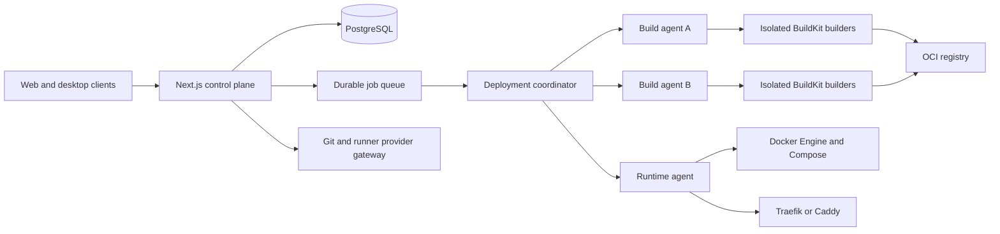

# genposed

**A visual Docker Compose editor, self-service deployment platform, and Docker management control plane built around Next.js.**

> **Project status:** early architecture and prototype development. Interfaces, storage formats, APIs, and deployment behavior may change before the first stable release.

genposed is intended for people who want the flexibility of Docker Compose without requiring every operator to hand-edit YAML or manually configure Git providers, reverse proxies, build workers, runners, and target servers.

The initial product is deliberately **single-tenant**: one installation, one workspace, and one primary environment with one or more projects. The internal model is tenant-aware so that isolated tenants and horizontally scalable shared build capacity can be introduced later without replacing the core architecture.

## Goals

- Provide a structured GUI for creating and editing complete Compose projects.
- Prevent indentation and formatting mistakes through typed, field-based editing.
- Keep Compose files portable and usable outside genposed.
- Validate against the Compose Specification, the target Docker/Compose version, and configurable best-practice policies.
- Connect GitHub, GitLab, Gitea, Forgejo, and Codeberg with an app-like onboarding flow.
- Register and operate native GitHub Actions, GitLab, Gitea Actions, Forgejo Actions, and Codeberg-compatible runners.
- Build images on one or more isolated BuildKit workers.
- Deploy and manage Compose stacks, containers, images, networks, volumes, logs, and commands.
- Manage Traefik, Caddy, Cloudflare DNS, certificates, routes, and reusable middlewares.
- Support client-aware and zero-downtime application updates.
- Keep the control plane fully self-service.

## Core principles

1. **Compose remains portable.** Projects can be imported, exported, stored in Git, and validated with the regular Docker CLI.
2. **The GUI edits a typed document model.** YAML is an import/export representation, not the primary form state.
3. **The control plane does not expose remote Docker sockets.** Runtime and build agents initiate authenticated outbound connections.
4. **Build servers provide capacity; builders provide isolation.** Each tenant receives isolated credentials, cache namespaces, limits, and builder state.
5. **Deployments are immutable records.** Every release is tied to a commit, source digest, rendered Compose digest, build result, and rollout history.
6. **Unsafe behavior is explicit.** Privileged containers, host networking, Docker socket mounts, dangerous capabilities, and destructive commands require policy decisions and audit records.
7. **Single-tenant first, multi-tenant ready.** The first release stays operationally simple while retaining workspace and tenant scope internally.

## Product areas

### Compose Studio

- Visual editors for services, builds, ports, volumes, networks, labels, secrets, configs, health checks, resources, security options, dependencies, logging, profiles, and extensions.
- Dynamically add, remove, reorder, and duplicate list or map entries.
- Support Compose short and long syntax while normalizing to a typed internal model.
- Optional raw YAML mode with round-trip validation and diff review.
- Preserve comments, anchors, aliases, and `x-*` extensions where possible.
- Detect multiple Compose files and configure named environments such as `compose.local.yml`, `compose.staging.yml`, and `compose.production.yml`.
- Generate platform-managed override files instead of rewriting application-owned configuration.
- Validate with JSON Schema, semantic rules, and `docker compose config`.

### Git and application discovery

- GitHub App and GitHub Enterprise Server support.
- GitLab.com and GitLab Self-Managed support.
- Gitea, Forgejo, and Codeberg support.
- Capability detection for hosted and self-hosted instances.
- Guided OAuth, application, authorized-integration, or token fallback onboarding.
- Automatic repository, branch, tag, Compose file, Dockerfile, framework, workspace, port, and environment-variable discovery.
- Monorepo support with multiple independently deployable applications.
- Automatic webhook creation and signed delivery validation.
- Commit, deployment, and preview-environment status reporting.

### Builds and runners

- BuildKit and Buildx based image builds.
- One or more build servers with capacity-based scheduling.
- Isolated builders, cache namespaces, registry credentials, and resource limits.
- AMD64, ARM64, and multi-platform builds.
- Persistent or ephemeral builders.
- GitHub Actions, GitLab, Gitea Actions, Forgejo Actions, and Codeberg-compatible runner management.
- Repository, organization, group, user, and instance scoped runners where supported.
- Persistent and single-job ephemeral runner modes.
- Automatic registration through provider APIs where possible, with a guided token fallback.

### Deployment and Docker management

- Agent-based management of local and remote Docker environments.
- Compose build, pull, up, down, restart, exec, run, logs, events, stats, wait, watch, and related commands.
- Portainer-like management of containers, images, volumes, networks, registries, events, logs, stats, and interactive exec sessions.
- Deployment queues, locks, approvals, health checks, smoke tests, migration steps, retries, cancellation, and rollback.
- Traefik and Caddy route generation.
- Cloudflare DNS, DNS challenge, certificate, tunnel, and zone automation.
- Reusable proxy middleware and policy templates.

### Zero-downtime and client-aware updates

Deployment behavior is selectable per application, Compose project, service, and environment.

Planned strategies include:

- Rolling Update
- A/B Deployment
- Blue-Green Deployment
- Canary Release
- Shadow Deployment
- Ring Deployment
- Feature Toggles
- Linear Rollout
- Expand and Contract
- Strangler Fig
- Active-Active
- Dark Launching
- Immutable Infrastructure
- Graceful Shutdown and Connection Draining
- Hot Standby
- Side-by-Side API Versioning
- Header-Based Routing
- Request Buffering
- Stateful Rollout with Sticky Sessions

For browser applications, an optional client SDK coordinates update notifications, reloads, service-worker updates, session migration, active-client heartbeats, and deployment-version acknowledgements. Old containers stop only after known active clients and sessions have migrated or a configured maximum drain deadline has expired.

## High-level architecture



The same physical machine may initially host the control plane, build agent, runtime agent, registry, and proxy. They remain separate logical roles so additional workers and runtime servers can be added later.

## Current repository status

The repository currently contains the project definition and an early schema-driven Compose editor prototype on the active development branch. Production deployment services, agents, provider integrations, and the build scheduler are planned work rather than finished capabilities.

See:

- [Documentation index](docs/README.md)
- [Product scope](docs/PRODUCT.md)
- [Architecture](docs/ARCHITECTURE.md)
- [Compose Studio](docs/COMPOSE_STUDIO.md)
- [Deployment strategies](docs/DEPLOYMENTS.md)
- [Git providers and runners](docs/GIT_AND_RUNNERS.md)
- [Build farm](docs/BUILD_FARM.md)
- [Security architecture](docs/SECURITY_ARCHITECTURE.md)
- [Roadmap](docs/ROADMAP.md)
- [Contributing](CONTRIBUTING.md)
- [Security policy](SECURITY.md)

## Planned repository structure

```text
apps/
  panel/                    Next.js control plane
  worker/                   background jobs and orchestration
  desktop/                  optional desktop packaging

services/
  provider-gateway/         Git provider and runner adapters
  build-coordinator/        build scheduling and quotas

agents/
  runtime-agent/            Docker, Compose, proxy, logs and metrics
  build-agent/              BuildKit builders and CI runners

packages/
  compose-model/            typed canonical document model
  compose-editor/           schema-driven visual editing
  compose-policy/           validation, security rules and autofixes
  agent-protocol/           versioned agent contracts
  docker-contracts/         Docker and Compose capability models
  provider-core/            provider abstractions
  runner-core/              runner abstractions
  build-contracts/          build requests and results
  observability/            events, metrics, logging and tracing

docs/
  ADR/                      architectural decision records
```

## Development

The current UI prototype is located under `userinterface/` on the development branch.

```bash
cd userinterface
pnpm install
pnpm schema:sync
pnpm dev
```

Open `http://localhost:3000`.

Before treating a generated file as deployable, validate it against the actual target runtime:

```bash
docker compose -f compose.yaml config
```

The example kitchen-sink document is a capability catalogue and intentionally contains platform-specific or mutually exclusive options. It is not intended to be deployed unchanged.

## Project maturity

genposed is not yet production-ready. In particular:

- authentication and authorization are not complete;
- secrets and agent identity are not production-hardened;
- provider and runner adapters are not implemented;
- build and runtime isolation are not implemented;
- zero-downtime strategies are design targets, not current guarantees;
- generated Compose output still requires validation against the target environment.

## Contributing

Read [CONTRIBUTING.md](CONTRIBUTING.md) before opening a pull request. Architecture-affecting changes should include or update an ADR under [`docs/ADR/`](docs/ADR/).

## Security

Do not report vulnerabilities in public issues. Follow [SECURITY.md](SECURITY.md).

## License

A project license has not yet been selected. Until a license file is added, copyright law applies and no general permission to copy, modify, or redistribute the code is granted.
