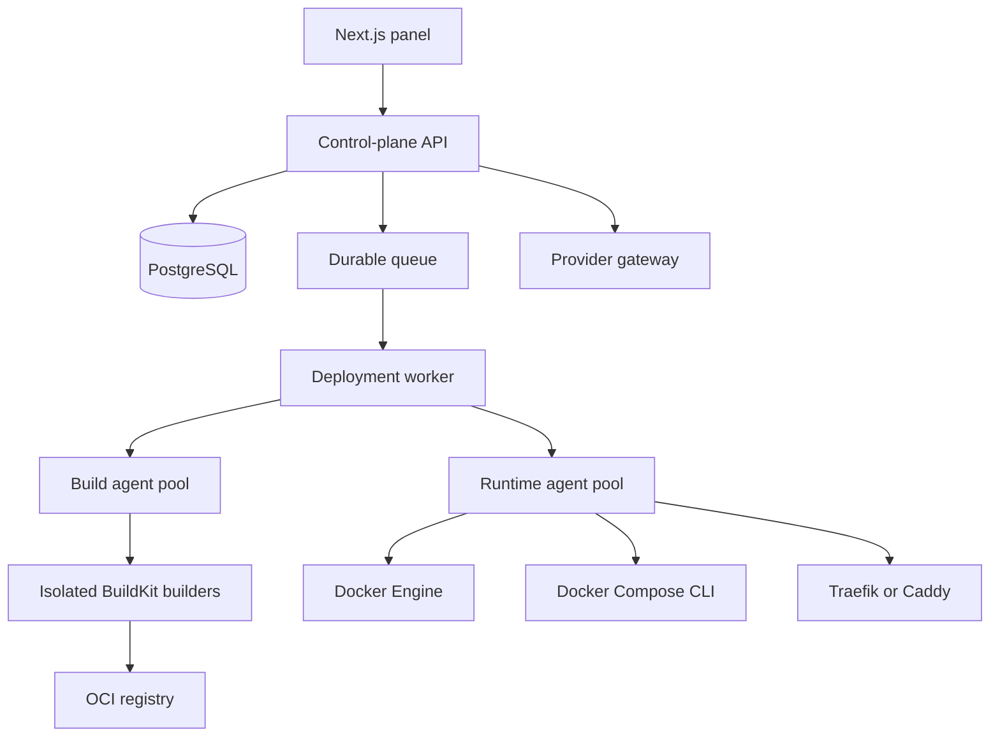

# Architecture

## Overview

genposed separates orchestration from execution.

- The **control plane** stores desired state, exposes the web interface and API, authenticates users, and creates durable jobs.
- **Workers** perform long-running orchestration.
- **Runtime agents** execute Docker, Compose, proxy, file, log, and metric operations on target servers.
- **Build agents** host isolated BuildKit builders and provider-native CI runners.
- The **provider gateway** normalizes Git and runner APIs.
- An **OCI registry** transfers immutable images from builders to runtime servers.



## Control plane

Responsibilities:

- users, sessions, workspace, projects, environments, and permissions;
- desired Compose configuration and generated overrides;
- provider connections and encrypted credentials;
- source revisions and webhook deliveries;
- build requests, deployment records, rollout state, and audit events;
- server inventory, capabilities, health, and agent identity;
- domains, certificates, middleware, and DNS configuration;
- API, web UI, desktop UI backend, and notifications.

The Next.js request lifecycle must not own builds or deployments. HTTP handlers validate input, persist intent, enqueue work, and return a job identifier.

## Durable workers

Workers execute idempotent state-machine steps:

```text
queued
→ source
→ render
→ validate
→ policy
→ build
→ publish
→ prepare runtime
→ migrate
→ deploy
→ verify
→ route
→ drain
→ complete
```

Each transition stores input digests, output references, timestamps, logs, exit codes, retry count, and failure classification.

Retries must be safe. A worker that crashes after starting an external action must reconcile the real state before repeating it.

## Agents

Agents make outbound authenticated connections to the control plane. No public Docker TCP socket is required.

### Runtime agent capabilities

- Docker Engine API access.
- Docker Compose CLI execution.
- file staging and digest verification;
- logs, events, stats, health, and process inspection;
- proxy dynamic configuration;
- certificate and network preparation;
- deployment locks and local reconciliation;
- graceful shutdown and connection draining hooks;
- volume backup and restore operations.

### Build agent capabilities

- BuildKit builder lifecycle;
- Buildx invocation;
- CPU, memory, disk, architecture, and concurrency reporting;
- cache and artifact cleanup;
- temporary source workspace management;
- registry authentication scoped to one build;
- provider-native runner container lifecycle.

### Agent protocol

The protocol must be versioned and backward compatible across rolling control-plane updates.

Every command includes:

- command ID;
- workspace or tenant scope;
- target server;
- capability and authorization scope;
- creation and expiry time;
- idempotency key;
- payload digest;
- expected agent protocol range.

Sensitive command responses are redacted before persistence.

## Source acquisition

Long-lived provider credentials should not be copied to runtime servers.

Preferred flow:

1. The provider gateway resolves a branch or tag to an immutable commit.
2. The control plane downloads or streams a source archive.
3. The archive is hashed and placed in temporary object storage.
4. A build or runtime agent receives a short-lived one-use URL.
5. The agent verifies the digest before extraction.

## Compose ownership modes

### Panel managed

The database is the source of truth. YAML is generated for deployment and export.

### Repository managed

Git is the source of truth. UI changes create a commit or pull/merge request before deployment.

### Hybrid

The repository owns application configuration. genposed owns an explicit generated override containing environment-specific routing, secrets references, platform networks, and deployment metadata.

Hybrid is the preferred production mode.

## Storage

Recommended baseline:

- PostgreSQL for relational state and durable job metadata;
- S3-compatible object storage for source archives, build artifacts, exports, and backups;
- OCI registry for deployable images and registry cache;
- optional Redis, NATS, or PostgreSQL-backed queue depending on operational goals;
- OpenTelemetry-compatible events and traces;
- Prometheus-compatible metrics;
- Loki or another durable log store for retained logs.

## Failure domains

Control-plane restarts must not stop running applications. Runtime agents continue local container operation and reconnect.

Build-server failure must requeue builds that have not published immutable results. Published images remain deployable.

Proxy configuration is applied transactionally: write candidate configuration, validate it, activate it, then retain the previous known-good version for rollback.

## Single-tenant now, multi-tenant later

The first installation creates a default workspace and environment automatically. All persistent entities still carry a workspace identifier. Tenant-level encryption keys, quotas, network policy, builder isolation, and registry namespaces can later be introduced without changing primary identifiers.
